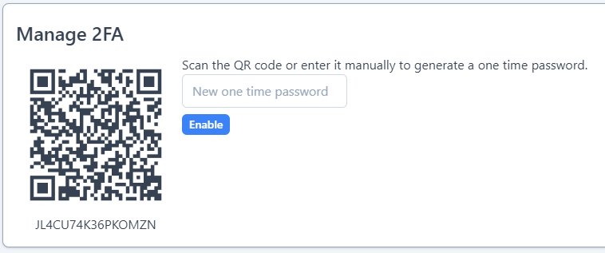
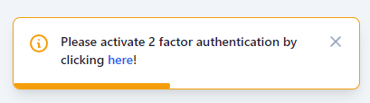

# Two-factor-authentication for Voyager II

This plugin for Voyager II uses [pragmarx/google2fa-laravel](https://github.com/antonioribeiro/google2fa-laravel) for two-factor-authentication.

## Installation

First, run `composer require emptynick/voyager-2fa`.  
After that run `php artisan 2fa:install`.  

This will:

1. Publish `pragmarx/google2fa-laravel` config file
2. Publish a migration to add a field named `google2fa_secret` to your `users` table
3. Migrate

You can skip publishing the config file and migrating.  
This is helpful when you want to modify the migration file.

## Usage

By default, this plugin does not force you to use 2FA.  
Whenever a 2FA code is assigned to a user, it will ask for it when logging-in.

### Activating 2FA for your account

Open the top-right user dropdown and click `Manage 2FA`.  
There you will see a QR code and an input box.  
Scan the QR code with your phone or enter the code manually and enter the generated OTP into the input.  
Click `Enable` and the code will be stored.  
Now, whenever you log-in, you'll be asked for a one-time-password.

### Disable 2FA

Clicking the `Disable` button will remove the OTP code from the database.  
You are **not** required to enter an OTP when logging-in.  
**This requires the setting `2FA.allow_disabling` to be `on`!**

### Renew 2FA code

When 2FA is active, you can simply renew the code. Proceed like described in `Activating 2FA for your account` and click on `Renew` instead of `Enable`!

## Settings

This plugin publishes some settings.

### 2FA.force_2fa

When active, this setting will prevent the user to open **any** page before setting-up 2FA. Defaults to false.

### 2FA.show_warning

Shows a warning whenever a page is opened and 2FA is **not** activated for the current user. Defaults to true.

### 2FA.allow_disabling

Allow users to disable two-factor-auth. Defaults to true.